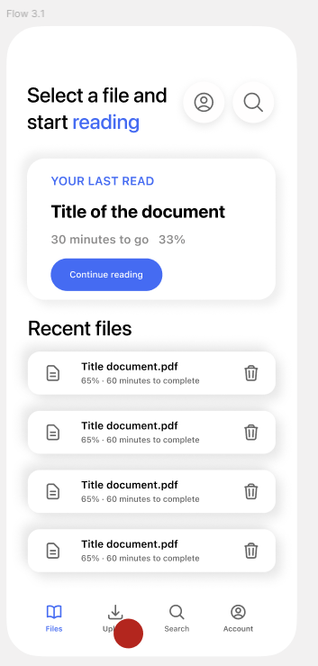
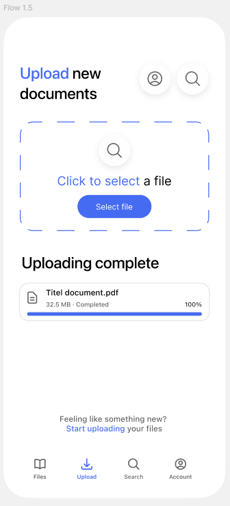
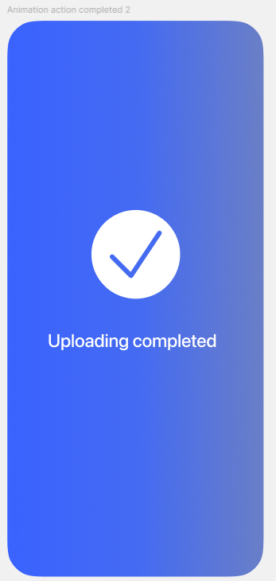

# RSVP Reader (Frontend)

Mobile-first RSVP (Rapid Serial Visual Presentation) reader built with Vite + React.

## Screenshots





## What You Can Do

- Create an account, sign in, and stay signed in (token stored locally)
- Upload EPUB or PDF files
- Browse your library and continue from where you left off
- Read using RSVP (one word at a time) with adjustable WPM
- Switch themes (stored locally)

## Tech Stack

- Vite + React 18
- React Router
- Tailwind CSS (theme tokens via CSS variables in `src/index.css`)
- Axios (`src/lib/api.js`)

## Getting Started

### Prerequisites

- Node.js (recommended: 18+)
- The backend API running locally on `http://localhost:8000`

### Install

```bash
npm ci
```

### Run (Dev)

```bash
npm run dev
```

The Vite dev server proxies `/api` to `http://localhost:8000` (see `vite.config.js`).

### Build / Preview

```bash
npm run build
npm run preview
```

## API Expectations

All requests are made to `/api` (see `src/lib/api.js`). In development, `/api` is proxied to `http://localhost:8000`.

Auth

- `POST /api/login` `{ username, password }` -> `{ token, user }`
- `POST /api/register` `{ name, password }` -> `{ token, user }`

Books

- `GET /api/books`
- `GET /api/books/:id`
- `DELETE /api/books/:id`
- `POST /api/books/upload` (multipart form-data with `file`)
- `GET /api/books/:id/pages/:pageNumber` -> `{ content, chapterTitle }`
- `GET /api/books/:id/content-start` -> `{ pageNumber }` (optional)

Progress

- `GET /api/progress/:bookId`
- `PUT /api/progress/:bookId` `{ pageNumber, wordIndex }`

## Local Storage

- `token`: bearer token attached to API requests
- `user`: JSON user object
- `wpm`: reader speed
- `theme`: selected theme id (`basic`, `pink`, `purple`, `mint`, `turquoise`, `bw`)

## Deployment Note

Production builds still call the API at `/api`. Make sure your hosting setup routes `/api` to the backend (or change `baseURL` in `src/lib/api.js`).
